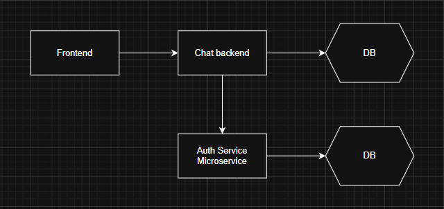

# Authentication Microservice

A standalone, stateless login & authentication service built with Spring Boot and Spring Security.
This microservice handles user registration, credential validation, and JWT introspection—decoupling security from business logic and enabling horizontal scalability.


---

# Architecture Overview


---

# Core Endpoints

## Method Path Description

- POST /api/auth/signup Register a new user (passwords hashed with BCrypt)
- POST /api/auth/login Authenticate credentials & issue JWT
- GET /api/auth/validate Validate a JWT; returns 200 OK if valid, else 401

---

## Security Stack & Technical Highlights

- Spring Security 6: Lambda-style SecurityFilterChain

- Custom UserDetailsService backed by MySQL via Spring Data JPA

- JWT (HS512): Stateless tokens with 1-hour time-to-live

JWTUtil: 
- Externalized 64+ character secret loaded via @Value("${jwt.secret}")

- Uses SecretKeySpec for HS512 signing and parsing

JwtAuthFilter:
- Intercepts protected routes and calls /api/auth/validate

- Populates Spring’s SecurityContext on successful validation


Error Handling:

- Uniform ApiResponse<T> wrapper (status | message | data)

- Strict HTTP status codes: 200, 400, 401, 500

- Detailed exception mapping with HttpClientErrorException & HttpServerErrorException

---

## Configuration

All configuration lives in src/main/resources/application.properties:

## Server
server.port=8080

## MySQL DataSource
```
spring.datasource.url=jdbc:mysql://localhost:3306/user_registration?useSSL=false&allowPublicKeyRetrieval=true
spring.datasource.username=auth_user
spring.datasource.password=auth_pass
```

## JWT Settings
```
jwt.secret=YOUR_64+_CHAR_RANDOM_SECRET_KEY_HERE
```

## Logging
```
logging.level.org.springframework.security=INFO
```

> Note: Replace YOUR_64+_CHAR_RANDOM_SECRET_KEY_HERE with a securely generated string of at least 64 characters.

---

# Getting Started

Prerequisites

- Java 17+

- Maven 3.6+

- MySQL (or compatible) running on localhost:3306


- Build & Run
```
git clone https://github.com/tanujveera/login-security-api.git
cd login-security-api
mvn clean package
mvn install
mvn spring-boot:run
```

---

# API CURL Scripts

1. Signup
```
curl --location 'http://localhost:8080/api/auth/signup' \
--header 'Content-Type: application/json' \
--data-raw '{
    "username":"tanujveera",
    "password":"Tanuj@123"
}'
```
Response
```
{
    "status": 200,
    "message": "User registered successfully",
    "data": "User saved"
}
```

---

2. Login
```
curl --location 'http://localhost:8080/api/auth/login' \
--header 'Content-Type: application/json' \
--data-raw '{
    "username":"tanujveera",
    "password":"Tanuj@123"
}'
```
Response
```
{
  "status": 200,
  "message": "Login successful",
  "data": { "token": "eyJhbGciOiJIUzU..." }
}
```

---

3. Validate
```
curl --location 'http://localhost:8080/api/auth/validate' \
--header 'Content-Type: application/json' \
--header 'Authorization: Bearer <token>' \
--data ''
```
Response
```
{
    "status": 200,
    "message": "Token is valid",
    "data": "true"
}
```

---

# Future Enhancements

- JWKS Endpoint to support asymmetric key rotation

- Refresh Tokens & Revocation Lists for immediate logout/revocation

- OAuth2 Client Credentials flow for inter-service authentication

- Resilience Patterns: caching, circuit breakers (Resilience4j)

- Observability: distributed tracing, metrics (Micrometer), audit logs
